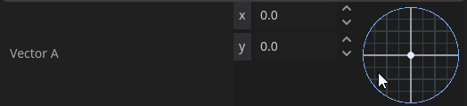

## VectorPad for Godot 4

Interactive Vector2 pad for the Godot Inspector.



### What it is
- **Inspector control for Vector2**: Replaces any `Vector2` property in the Inspector with a compact, draggable pad.
- **Precise numeric editing**: Synced X/Y fields stay aligned with the pad at all times.
- **Clear visuals**: Grid, axes, circular boundary, vector line, and handle rendered via a custom shader.
- **Live updates**: If your script changes the vector at runtime, the pad reflects it immediately.

### Quick start
1. Copy `addons/vectorpad` into your project.
2. In Godot: Project → Project Settings → Plugins → enable `VectorPad`.
3. Export a `Vector2` on any script. The Inspector will show the pad automatically.

```gdscript
extends Node

@export var movement: Vector2 = Vector2(1, 0)
```

- Drag in the pad to set the vector.
- Edit the X/Y fields for exact values.

### Requirements
- Godot 4+

### Development
- Core inspector integration: `addons/vectorpad/src/vector2_inspector_plugin.gd`
- Shader for the pad: `addons/vectorpad/src/vector_pad_shader.gdshader`
- Plugin entry point: `addons/vectorpad/plugin.gd`

Run the demo scene `test_scene.tscn` to verify behavior.
